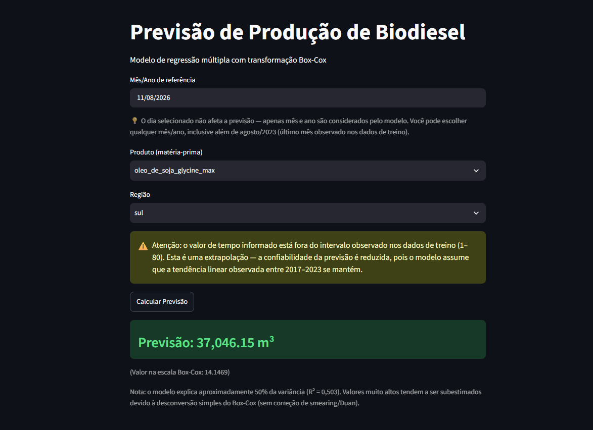

# Regressão Linear Múltipla - Produção de Biodiesel no Brasil

## 📖 Etapas do Projeto
### 1. Coleta dos Dados
- **Fonte:** [Painel de Produção de Etanol e Biodiesel](https://dados.gov.br/dados/conjuntos-dados/paineis-de-producao-de-etanol-e-de-biodiesel) — ANP
  - Arquivo: Matéria-Prima utilizada na Produção de Biodiesel (CSV)
  - Período: jan/2017 a ago/2023 (80 meses)
### 2. Metodologia
- Limpeza e padronização dos dados (Python + Pandas)
- Dummização de produto e região (regra n-1, drop_first=True)
- Estimação inicial com todas as variáveis (produto, região, estado, tempo)
- Diagnóstico de multicolinearidade (VIF) — inclusão proposital de estado junto com região para demonstrar multicolinearidade perfeita (VIF = ∞, Cond. No. ≈ 10¹⁶)
- **Stepwise** — remoção de variáveis não significativas pelo teste t
- **Shapiro-Francia** — teste de normalidade dos resíduos (não Omnibus/Jarque-Bera)
- **Box-Cox** — transformação de Y para corrigir não-normalidade (λ ≈ 0,054, próximo de log-natural)
- Segundo Stepwise pós-transformação
- **Breusch-Pagan** — confirmação de homocedasticidade
### 3. Resultado do Modelo Final
| Modelo | Descrição | R² |
|---|---|---|
| modelo_biodiesel_1 | Com estado + região | — (multicolinearidade perfeita, didático) |
| modelo_biodiesel_2 | Sem estado | 50,2% |
| modelo_step_bc_biodiesel | **Modelo final** (Box-Cox + 2º Stepwise) | **50,31%** |
O modelo final manteve 13 das 27 variáveis originais, com R² de 50,31% — metade da variação no volume de matéria-prima é explicada pelo modelo; a outra metade reflete fatores fora do escopo (preço de commodities, safra agrícola, política de incentivo).
**Principais achados:**
- Óleo de soja é a única matéria-prima com coeficiente positivo em relação à referência
- Sul é a única região com coeficiente positivo em relação ao Centro-Oeste
**Limitações:** retransformação de Box-Cox subestima valores altos (Jensen); validade preditiva restrita ao período observado (jan/2017–ago/2023), sem série temporal atualizada disponível.
---
## 🖥️ App de Previsão (Streamlit)
src/app_previsao_biodiesel.py carrega o modelo final serializado (outputs/modelo_biodiesel_final.pkl) e permite prever quantidade_m3 a partir de data, produto e região, com avisos automáticos para categorias não significativas e extrapolação de data.
bash
cd src
streamlit run app_previsao_biodiesel.py

  

## ⚙️ Como Rodar
bash
pip install -r requirements.txt
jupyter notebook src/script_biodiesel.ipynb

## 📁 Estrutura
    sl-biodiesel-reg/
    ├── data/
    │   └── biodiesel-materia-prima.csv
    ├── src/
    │   ├── script_biodiesel.ipynb
    │   └── app_previsao_biodiesel.py
    ├── outputs/
    │   └── modelo_biodiesel_final.pkl
    ├── assets/
    │   └── screenshot_app.png
    ├── requirements.txt
    └── README.md
